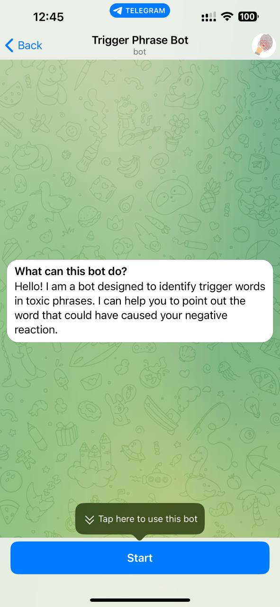
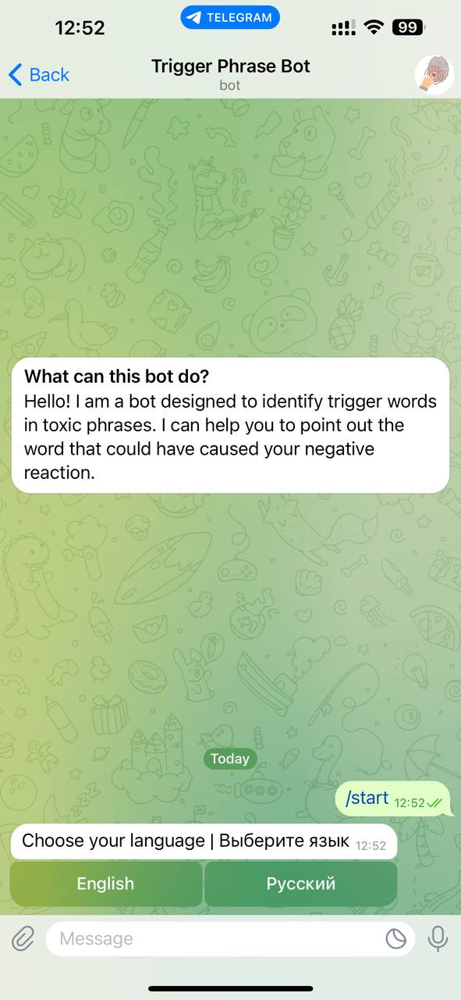
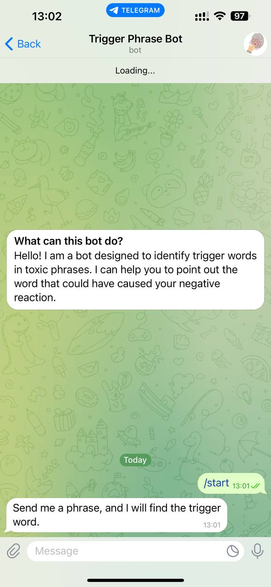
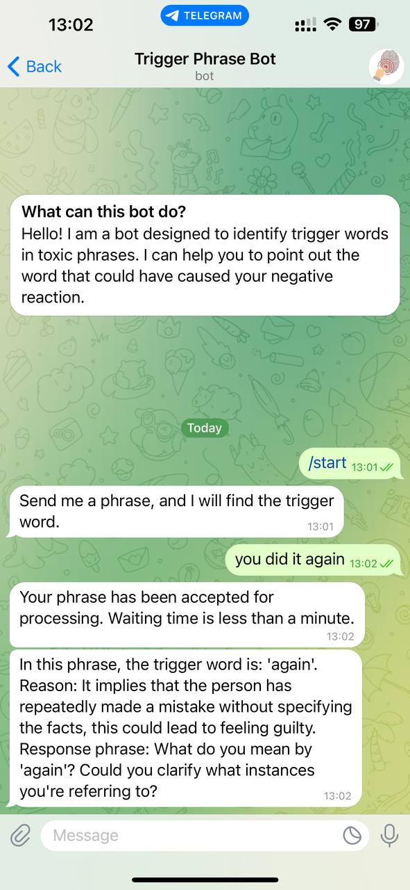

# Trigger Phrase Bot

## Overview

## Overview

The Trigger Phrase Bot is a Telegram bot designed to identify and highlight 'trigger words' in conversations that might lead to negative reactions or manipulate the discussion. Currently operational on a local setup, the bot is planned to be deployed on servers for wider accessibility. Utilizing OpenAI's GPT for natural language processing, this bot is skilled at detecting words that can subtly influence the emotional context of dialogues, often without adding meaningful content. These words can be particularly damaging in both professional and personal interactions. The bot’s goal is to promote positive and constructive communication. Offering support in English and Russian, it helps ensure that online conversations remain informative and respectful, free from emotionally charged or manipulative language.

Check out the Trigger Phrase Bot on Telegram: [Trigger Phrase Bot](https://t.me/trigger_phrase_bot)


## Screenshots

<details>
  <summary>Bot Introduction</summary>
  
</details>

<details>
  <summary>Language Selection</summary>
  
</details>

<details>
  <summary>Bot Interaction</summary>
  
</details>

<details>
  <summary>Analysis Result</summary>
  
</details>


## Features

- **Phrase Analysis**: The bot examines phrases provided by users, highlighting any trigger words.
- **AI-Powered**: Utilizes OpenAI's ChatGPT for intelligent text analysis.
- **Multi-language Support**: Offers services in both English and Russian.
- **User-Friendly**: Easy to use with clear instructions and a straightforward startup process.

## Future Scope

- **Custom Large Language Model**: To further refine detection capabilities.
- **Server Deployment**: While currently running on a local setup, plans are in place to deploy the bot on servers for enhanced availability and performance.
- **Language Expansion**: To include more languages and broaden the user base.


## Requirements

- Java JDK 11 or higher
- Maven
- Telegram Bot API key
- OpenAI API key

## Installation

```shell
git clone [repository link]
cd [project name]
mvn install
```

## Configuration
Create a .txt file application.properties in the root directory of the project and add the following variables with your respective API keys:
```bash
bot.token=your_telegram_bot_token
bot.username=your_telegram_bot_username
database.url=your_database_url
gpt.api.key=your_openai_api_key
```

## Usage
- Send the /start command to the bot in Telegram.
- Follow the instructions provided by the bot to input and analyze phrases.

## Contributing
Contributions are welcome! Please fork the repository and submit a pull request with your features or fixes.